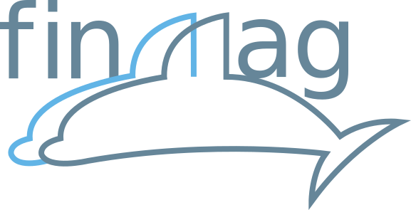

# FinMag: finite elements micromagnetic simulation tool

Dmitri Chernyshenko1, Marc-Antonio Bisotti1, Maximilian Albert1, Weiwei Wang1, Anders Johansen1, Gabriel Balaban1, Marijan Beg1,2, David Cortés-Ortuño1, Mark Vousden1, Rebecca Carey1, Ryan A. Pepper1, Leoni Breth1, Thomas Kluyver1, and Hans Fangohr1,2

1 Faculty of Engineering and the Environment, University of Southampton, Southampton SO17 1BJ, United Kingdom  
2 European XFEL GmbH, Holzkoppel 4, 22869 Schenefeld, Germany

## About

- It was intended to be a thin (and mostly) Python layer on top of [FEniCS](https://fenicsproject.org/) to enable Python-scripted multi-physics micromagnetic simulations. Some compiled code moved into the project. 

- The name FINmag originates from the dolFIN interface to [FEniCS](http://fenicsproject.org).

- The code has beed developed from 2011 to 2018 by [Hans Fangohr's](http://fangohr.github.io) group at the University of Southampton and European XFEL GmbH.

- This is a working prototype - not polished, with some (in large parts outdated) attempts of documentation. There is also some outdated code in the repository.

- Does not execute efficiently in parallel (time integration is serial).

- We do not consider the codebase, documentation, and other content of sufficient quality to encourage uptake in the community. (Experts are welcome!) This is primarily a resource problem.

- There is no support is available.

- Contributions and pull requests to both the code and documentation are welcome, but no promise can be made that these will be reviewed and/or integrated.

- The GitHub page of the project is [here](https://github.com/fangohr/finmag).

- The code has been used for a number of scientific studies and publications (see the [Publications](#Publications) section).

- The repository may well be of historical value and probably captures some of the typical research software engineering challenges. (We should write up a summary of our gathered experiences.)

- There has not been dedicated funding to support the software development.

## Installing / Using the tool via Docker

We provide pre-built image at DockerHub under [`finmag/finmag`](XXX) repository. More information about Docker as well as on how to install it on your system can be found [here](https://www.docker.com/).

### Getting the image

You can obtain the most recent image by pulling it from DockerHub [`finmag/finmag`](XXX) repository

    docker pull finmag/finmag

### Running the container

In order to check whether the tests pass inside the docker container, you should run

    docker run -ti -v $(pwd):/io finmag/finmag bash -c "py.test"

To run your finmag code inside docker, please navigate to the directory where your `.py` file is (`cd path/to/your/file`) and run

    docker run -ti -v $(pwd):/io finmag/finmag bash -c "python my-finmag-script.py"

This section will be extended and updated when Marijan pushes finmag images to the finmag DockerHub organisation.

More detailed comments on the installation are in [`install/README.md`](install/README.md).

## Documentation

The documentation in the form of [Jupyter](http://jupyter.org/) notebooks is available in [`doc/ipython_notebooks_src`](doc/ipython_notebooks_src) directory.

## License

Finmag is licensed under the BSD 3-Clause "New" or "Revised" License. For details, please refer to the [LICENSE](LICENSE) file. However, portions of the source code (src/util/numpy.h) are subject to the Boost Software License.

## How to cite

If you use this OOMMF extension in your research, please cite it as:

1. (Zenodo DOI will go here when we make the repository public)

## Publications

Finmag was used to run micromagnetic simulations in the following publications, including:

1. R. A. Pepper, M. Beg, D. Cortés-Ortuño, T. Kluyver, M.-A. Bisotti, R. Carey, M. Vousden, M. Albert, W. Wang, O. Hovorka, and H. Fangohr. Skyrmion states in thin confined polygonal nanostructures. Journal of Applied Physics 9, 093903 (2018). (arXiv:1801.03275)

2. D. Cortés-Ortuño, W. Wang, M. Beg, R. A. Pepper, M.-A. Bisotti, R. Carey, M. Vousden, T. Kluyver, O. Hovorka, and H. Fangohr. Thermal stability and topological protection of skyrmions in nanotracks. Scientific Reports 7, 4061 (2017). (arXiv:1611.07079)

3. M. Beg, M. Albert, M.-A. Bisotti, D. Cortés-Ortuño, W. Wang, R. Carey, M. Vousden, O. Hovorka, C. Ciccarelli, C. S. Spencer, C. H. Marrows, and H. Fangohr. Dynamics of skyrmionic states in confined helimagnetic nanostructures. Physical Review B 95, 014433 (2017). (arXiv:1604.08347)

4. A. Baker, M. Beg, G. Ashton, M. Albert, D. Chernyshenko, W. Wang, S. Zhang, M.-A. Bisotti, M. Franchin, C. Lian Hu, R. L. Stamps, T. Hesjedal, and H. Fangohr. Proposal of a micromagnetic standard problem for ferromagnetic resonance simulations. Journal of Magnetism and Magnetic Materials 421, 428-439 (2017). (arXiv:1603.05419)

5. R. Carey, M. Beg, M. Albert, M.-A. Bisotti, D. Cortés-Ortuño, M. Vousden, W. Wang, O. Hovorka, and H. Fangohr. Hysteresis of nanocylinders with Dzyaloshinskii-Moriya interaction. Applied Physics Letters 109, 122401 (2016). (arXiv:1606.05181)

6. M. Albert, M. Beg, D. Chernyshenko, M.-A. Bisotti, R. L. Carey, H. Fangohr, and P. J. Metaxas. Frequency-based nanoparticle sensing over large field ranges using the ferromagnetic resonances of a magnetic nanodisc. Nanotechnology 27, 455502 (2016). (arXiv:1604.07277)

7. M. Vousden, M. Albert, M. Beg, M.-A. Bisotti, R. Carey, D. Chernyshenko, D. Cortés-Ortuño, W. Wang, O. Hovorka, C. H. Marrows, and H. Fangohr. Skyrmions in thin films with easy-plane magnetocrystalline anisotropy. Applied Physics Letters 108, 132406 (2016). (arXiv:1602.02064)

8. M. Beg, R. Carey, W. Wang, D. Cortés-Ortuño, M. Vousden, M.-A. Bisotti, M. Albert, D. Chernyshenko, O. Hovorka, R. L. Stamps, and H. Fangohr. Ground state search, hysteretic behaviour, and reversal mechanism of skyrmionic textures in confined helimagnetic nanostructures. Scientific Reports 5, 17137 (2015). (arXiv:1312.7665)

9. W. Wang, M. Albert, M. Beg, M.-A. Bisotti, D. Chernyshenko, D. Cortés-Ortuño, I. Hawke, and H. Fangohr. Magnon driven domain wall motion with Dzyaloshinskii-Moriya interaction. Physical Review Letters 114, 087203 (2015). (arXiv:1406.5997)

10. W. Wang, M. Beg, B. Zhang, W. Kuch, and H. Fangohr. Driving magnetic skyrmions with microwave fields. Physical Review B (Rapid Communications) 92, 020403 (2015). (arXiv:1505.00445)

11. W. Wang, M. Dvornik, M.-A. Bisotti, D. Chernyshenko, M. Beg, M. Albert, A. Vansteenkiste, B. V. Waeyenberge, A. N. Kuchko, V. V. Kruglyak, and H. Fangohr. Phenomenological description of the nonlocal magnetization relaxation in magnonics, spintronics, and domain-wall dynamics. Physical Review B 92, 054430 (2015). (arXiv:1508.01478)

12. B. Zhang, W. Wang, M. Beg, H. Fangohr, and W. Kuch. Microwave-induced dynamic switching of magnetic skyrmion cores in nanodots. Applied Physics Letters 106, 102401 (2015). (arXiv:1503.02869)

## Acknowledgements

We acknowledge the support from

- EPSRC’s Doctoral Training Centre in Complex System Simulation (EP/G03690X/1),

- EPSRC's Centre for Doctoral Training in Next Generation Computational Modelling (#EP/L015382/1).

- Horizon 2020 European Research Infrastructure project [OpenDreamKit](http://opendreamkit.org/) (676541).

- EPSRC's Programme [grant](https://www.skyrmions.ac.uk/) on Skyrmionics (EP/N032128/1)
